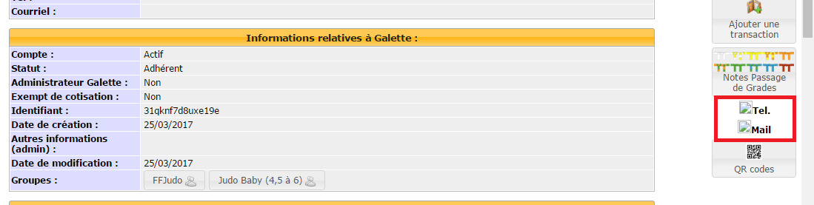
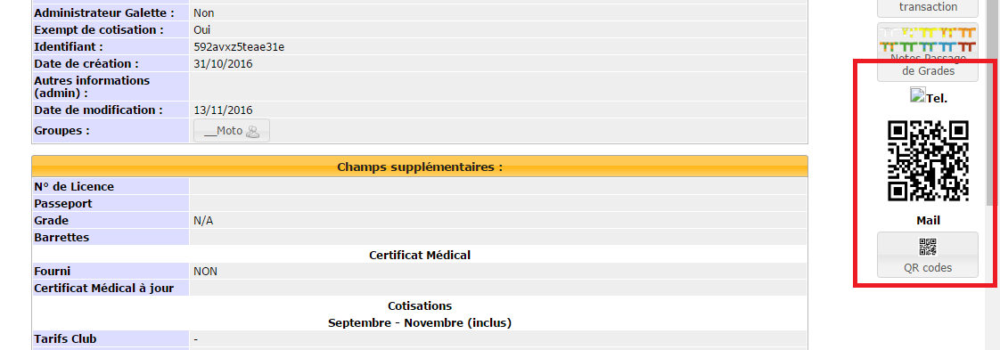
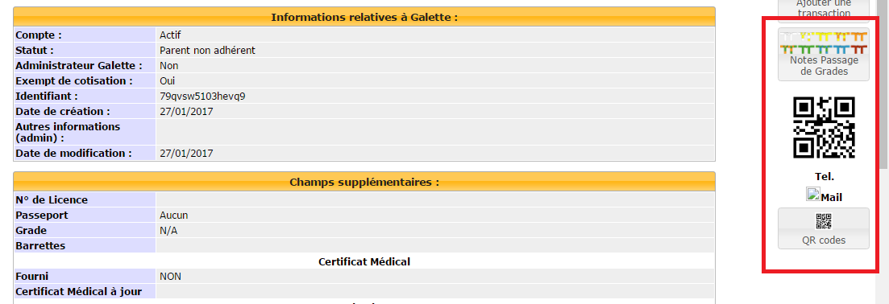
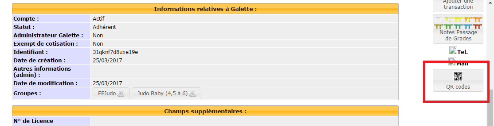

## Galette plugin QRCodes

Galette QRCodes est un plugin réalisé pour Galette permettant la génération de QRCodes.

## Utilisation

Sur les fiches adhérent vous remarquerez la présence de QR Codes.

Ils vont servir à avoir un accès rapide aux informations de contact suivantes:
- téléphone
- mail
Moyennant d'avoir une application de lecteur de QR code sur votre support numérique, vous scannez le QR code dont vous voulez l'information et vous êtes directement redirigés vers l'information de contact choisie. Vous pouvez ainsi soit appeler le contact, soit lui envoyer un mail.

### Sur la fiche adhérent

Les QR Codes sont situés à droite de l'écran sur la fiche adhérent.

Le premier « tel » sert à appeler le contact, le second « mail » sert à envoyer un mail au contact.

### QR Code manquant

Si vous remarquez l'absence d'un QR code sur la fiche adhérent, 2 solutions :
- soit une information de contact est manquante
- soit le QR code n'a pas encore été créer

Les affichages possibles seront les suivants :

- manque téléphone et mail

- manque téléphone

- manque mail

### Générer un QR Code

Pour créer un QR Code manquant, il vous suffit de cliquer sur le bouton « QR codes ».

### Modifier un QR Code

En cas de modification de contact, il faut cliquer sur le bouton « QR Codes ».
Cela va écraser les anciennes informations et créer les nouvelles.

